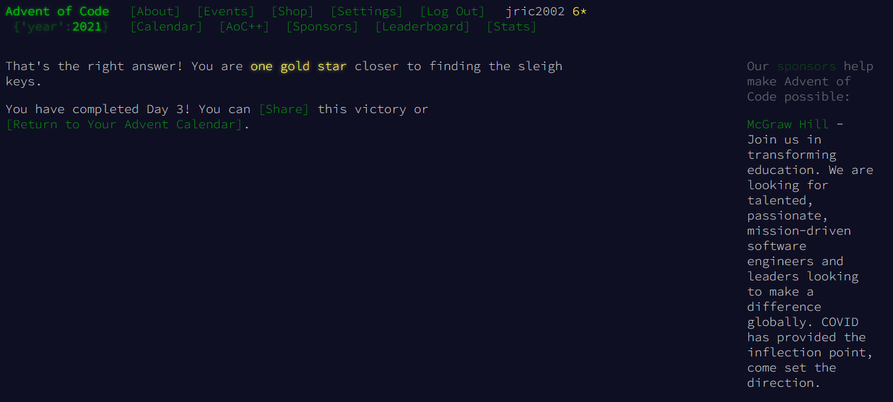
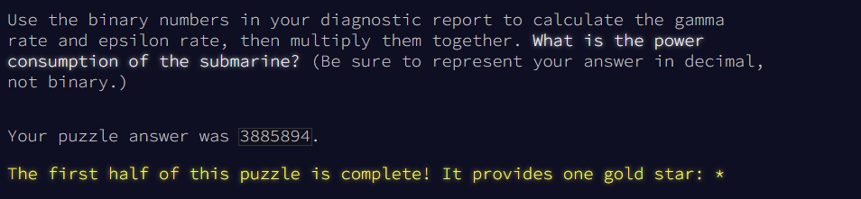
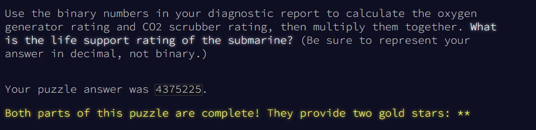

# Day 3: Binary Diagnostic


## First part
The submarine has been making some odd creaking noises, so you ask it to produce a diagnostic report just in case.

The diagnostic report (your puzzle input) consists of a list of binary numbers which, when decoded properly, can tell you many useful things about the conditions of the submarine. The first parameter to check is the **power consumption**.

You need to use the binary numbers in the diagnostic report to generate two new binary numbers (called the **gamma rate** and the **epsilon rate**). The power consumption can then be found by multiplying the gamma rate by the epsilon rate.

Each bit in the gamma rate can be determined by finding the **most common bit in the corresponding position** of all numbers in the diagnostic report. For example, given the following diagnostic report:
```
00100
11110
10110
10111
10101
01111
00111
11100
10000
11001
00010
01010
```

Considering only the first bit of each number, there are five `0` bits and seven `1` bits. Since the most common bit is `1`, the first bit of the gamma rate is `1`.

The most common second bit of the numbers in the diagnostic report is `0`, so the second bit of the gamma rate is `0`.

The most common value of the third, fourth, and fifth bits are `1`, `1`, and `0`, respectively, and so the final three bits of the gamma rate are `110`.

So, the gamma rate is the binary number `10110`, or **`22`** in decimal.

The epsilon rate is calculated in a similar way; rather than use the most common bit, the least common bit from each position is used. So, the epsilon rate is `01001`, or **`9`** in decimal. Multiplying the gamma rate (`22`) by the epsilon rate (`9`) produces the power consumption, **`198`**.

Use the binary numbers in your diagnostic report to calculate the gamma rate and epsilon rate, then multiply them together. **What is the power consumption of the submarine?** (Be sure to represent your answer in decimal, not binary.)

To begin, [get your puzzle input](./input.txt).

**Solution**:
```cpp
#include <iostream>
#include <fstream>
#include <cstring>
/* Author: José Rodolfo (jric2002) */
using namespace std;
int main() {
  string file_name = "input.txt";
  ifstream file(file_name.c_str());
  if (file.is_open()) {
    unsigned int amount_bit_one[12] = {0, 0, 0, 0, 0, 0, 0, 0, 0};
    unsigned int amount_bit_zero[12] = {0, 0, 0, 0, 0, 0, 0, 0, 0};
    bool gamma_rate_in_bits[12];
    bool epsilon_rate_in_bits[12];
    unsigned int gamma_rate = 0, epsilon_rate = 0;
    unsigned int power_consumption = 0;
    string binary_number;
    // Count the number of bits 1 and 0
    while (!file.eof()) {
      file >> binary_number;
      for (unsigned short int position = 0; position < 12; position++) {
        if (binary_number[position] == '1') {
          amount_bit_one[position]++;
        }
        else if (binary_number[position] == '0') {
          amount_bit_zero[position]++;
        }
        else {
          continue;
        }
      }
    }
    // Calculation of gamma rate and epsilon rate
    for (unsigned short int position = 0; position < 12; position++) {
      if (amount_bit_one[position] > amount_bit_zero[position]) {
        gamma_rate_in_bits[position] = 1;
        epsilon_rate_in_bits[position] = 0;
      }
      else {
        gamma_rate_in_bits[position] = 0;
        epsilon_rate_in_bits[position] = 1;
      }
    }
    // Binary to decimal
    unsigned short int base = 1;
    for (signed short int position = 12 - 1; position >= 0; position--) {
      if (gamma_rate_in_bits[position] == 1) {
        gamma_rate += base;
      }
      if (epsilon_rate_in_bits[position] == 1) {
        epsilon_rate += base;
      }
      base = base * 2;
    }
    power_consumption = gamma_rate * epsilon_rate;
    cout << "Gamma rate: " << gamma_rate << endl;
    cout << "Epsilon rate: " << epsilon_rate << endl;
    cout << "Power consumption: " << power_consumption << endl;
    file.close();
  }
  else {
    cout << "Cannot open " << file_name << " file" << endl;
  }
  return 0;
}
```

The answer is: `3885894`  


## Second part
Next, you should verify the **life support rating**, which can be determined by multiplying the **oxygen generator rating** by the **CO2 scrubber rating**.

Both the oxygen generator rating and the CO2 scrubber rating are values that can be found in your diagnostic report - finding them is the tricky part. Both values are located using a similar process that involves filtering out values until only one remains. Before searching for either rating value, start with the full list of binary numbers from your diagnostic report and **consider just the first bit** of those numbers. Then:
- Keep only numbers selected by the **bit criteria** for the type of rating value for which you are searching. Discard numbers which do not match the bit criteria.
- If you only have one number left, stop; this is the rating value for which you are searching.
- Otherwise, repeat the process, considering the next bit to the right.

The **bit criteria** depends on which type of rating value you want to find:
- To find **oxygen generator rating**, determine the **most common** value (`0` or `1`) in the current bit position, and keep only numbers with that bit in that position. If `0` and `1` are equally common, keep values with a `1` in the position being considered.
- To find **CO2 scrubber rating**, determine the **least common** value (`0` or `1`) in the current bit position, and keep only numbers with that bit in that position. If `0` and `1` are equally common, keep values with a `0` in the position being considered.

For example, to determine the **oxygen generator rating** value using the same example diagnostic report from above:
- Start with all 12 numbers and consider only the first bit of each number. There are more `1` bits (7) than `0` bits (5), so keep only the 7 numbers with a `1` in the first position: `11110`, `10110`, `10111`, `10101`, `11100`, `10000`, and `11001`.
- Then, consider the second bit of the 7 remaining numbers: there are more `0` bits (4) than `1` bits (3), so keep only the 4 numbers with a `0` in the second position: `10110`, `10111`, `10101`, and `10000`.
- In the third position, three of the four numbers have a `1`, so keep those three: `10110`, `10111`, and `10101`.
- In the fourth position, two of the three numbers have a `1`, so keep those two: `10110` and `10111`.
- In the fifth position, there are an equal number of `0` bits and `1` bits (one each). So, to find the **oxygen generator rating**, keep the number with a `1` in that position: `10111`.
- As there is only one number left, stop; the **oxygen generator rating** is `10111`, or **`23`** in decimal.

Then, to determine the **CO2 scrubber rating** value from the same example above:
- Start again with all 12 numbers and consider only the first bit of each number. There are fewer `0` bits (5) than `1` bits (7), so keep only the 5 numbers with a `0` in the first position: `00100`, `01111`, `00111`, `00010`, and `01010`.
- Then, consider the second bit of the 5 remaining numbers: there are fewer `1` bits (2) than `0` bits (3), so keep only the 2 numbers with a `1` in the second position: `01111` and `01010`.
- In the third position, there are an equal number of `0` bits and `1` bits (one each). So, to find the **CO2 scrubber rating**, keep the number with a `0` in that position: `01010`.
- As there is only one number left, stop; the **CO2 scrubber rating** is `01010`, or **`10`** in decimal.

Finally, to find the life support rating, multiply the oxygen generator rating (`23`) by the CO2 scrubber rating (`10`) to get **`230`**.

Use the binary numbers in your diagnostic report to calculate the oxygen generator rating and CO2 scrubber rating, then multiply them together. **What is the life support rating of the submarine?** (Be sure to represent your answer in decimal, not binary.)

Although it hasn't changed, you can still [get your puzzle input](./input.txt).

**Solution**:
```cpp
#include <iostream>
#include <fstream>
#include <cstring>
/* Author: José Rodolfo (jric2002) */
using namespace std;
int main() {
  string file_name = "input.txt";
  ifstream file(file_name.c_str());
  if (file.is_open()) {
    unsigned short int quantity_bits = 12;
    unsigned int amount_bit_one, amount_bit_zero;
    string first_bits_rating;
    string oxygen_generator_rating_in_bits;
    unsigned int oxygen_generator_rating = 0;
    string co2_scrubber_rating_in_bits;
    unsigned int co2_scrubber_rating = 0;
    unsigned int life_support_rating;
    string binary_number;
    string first_bits_binary_number;
    unsigned int binary_numbers_found;
    // Searching oxygen generator rating and co2 scrubber rating
    for (unsigned short int rating_number = 0; rating_number < 2; rating_number++) {
      first_bits_rating = "";
      for (unsigned short int position = 0; position < quantity_bits; position++) {
        amount_bit_one = amount_bit_zero = 0;
        binary_numbers_found = 0;
        while (!file.eof()) {
          file >> binary_number;
          first_bits_binary_number = binary_number.substr(0, position);
          if (first_bits_binary_number == first_bits_rating) {
            if (binary_number[position] == '1') {
              amount_bit_one++;
            }
            else {
              amount_bit_zero++;
            }
            binary_numbers_found++;
          }
        }
        if (amount_bit_one >= amount_bit_zero) {
          if (binary_numbers_found == 1) {
            first_bits_rating += "1";
          }
          else {
            if (rating_number == 0) {
              first_bits_rating += "1";
            }
            else {
              first_bits_rating += "0";
            }
          }
        }
        else {
          if (binary_numbers_found == 1) {
            first_bits_rating += "0";
          }
          else {
            if (rating_number == 0) {
              first_bits_rating += "0";
            }
            else {
              first_bits_rating += "1";
            }
          }
        }
        file.seekg(0, ios::beg);
      }
      if (rating_number == 0) {
        oxygen_generator_rating_in_bits = first_bits_rating;
      }
      else {
        co2_scrubber_rating_in_bits = first_bits_rating;
      }
    }
    // Binary to decimal
    unsigned short int base = 1;
    for (signed short int position = quantity_bits - 1; position >= 0; position--) {
      if (oxygen_generator_rating_in_bits[position] == '1') {
        oxygen_generator_rating += base;
      }
      if (co2_scrubber_rating_in_bits[position] == '1') {
        co2_scrubber_rating += base;
      }
      base = base * 2;
    }
    life_support_rating = oxygen_generator_rating * co2_scrubber_rating;
    cout << "Oxygen generator rating: " << oxygen_generator_rating << endl;
    cout << "CO2 scrubber rating: " << co2_scrubber_rating << endl;
    cout << "Life support rating: " << life_support_rating << endl;
    file.close();
  }
  else {
    cout << "Cannot open " << file_name << " file" << endl;
  }
  return 0;
}
```

The answer is: `4375225`  
