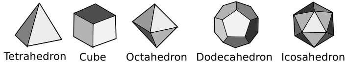

# Anton and Polyhedrons
**Problem code**: 785A  
**Tags**: implementation, strings  
**Time limit per test**: 2 seconds  
**Memory limit per test**: 256 megabytes  
**Input**: standard input  
**Output**: standard output  

Anton's favourite geometric figures are regular polyhedrons. Note that there are five kinds of regular polyhedrons:
* Tetrahedron. Tetrahedron has `4` triangular faces.
* Cube. Cube has `6` square faces.
* Octahedron. Octahedron has `8` triangular faces.
* Dodecahedron. Dodecahedron has `12` pentagonal faces.
* Icosahedron. Icosahedron has `20` triangular faces.

All five kinds of polyhedrons are shown on the picture below:


Anton has a collection of `n` polyhedrons. One day he decided to know, how many faces his polyhedrons have in total. Help Anton and find this number!

## Input
The first line of the input contains a single integer `n (1 ≤ n ≤ 200 000)` — the number of polyhedrons in Anton's collection.

Each of the following n lines of the input contains a string `si` — the name of the i-th polyhedron in Anton's collection. The string can look like this:
* "`Tetrahedron`" (without quotes), if the i-th polyhedron in Anton's collection is a tetrahedron.
* "`Cube`" (without quotes), if the i-th polyhedron in Anton's collection is a cube.
* "`Octahedron`" (without quotes), if the i-th polyhedron in Anton's collection is an octahedron.
* "`Dodecahedron`" (without quotes), if the i-th polyhedron in Anton's collection is a dodecahedron.
* "`Icosahedron`" (without quotes), if the i-th polyhedron in Anton's collection is an icosahedron.

## Output
Output one number — the total number of faces in all the polyhedrons in Anton's collection.

## Examples
| input |
| :--- |
| 4 |
| Icosahedron |
| Cube |
| Tetrahedron |
| Dodecahedron |

| output |
| :--- |
| 42 |

| input |
| :--- |
| 3 |
| Dodecahedron |
| Octahedron |
| Octahedron |

| output |
| :--- |
| 28 |

## Note
In the first sample Anton has one icosahedron, one cube, one tetrahedron and one dodecahedron. Icosahedron has `20` faces, cube has `6` faces, tetrahedron has `4` faces and dodecahedron has `12` faces. In total, they have `20 + 6 + 4 + 12 = 42` faces.

## Solution
The solution in **C++**:
```cpp
#include <iostream>
#include <cstring>
#include <vector>
/* Author: José Rodolfo (jric2002) */
using namespace std;
struct Polyhedron {
  string name;
  unsigned short int faces;
};
int main() {
  struct Polyhedron tetrahedron = {"Tetrahedron", 4};
  struct Polyhedron cube = {"Cube", 6};
  struct Polyhedron octahedron = {"Octahedron", 8};
  struct Polyhedron dodecahedron = {"Dodecahedron", 12};
  struct Polyhedron icosahedron = {"Icosahedron", 20};
  vector<Polyhedron> polyhedrons;
  polyhedrons.push_back(tetrahedron);
  polyhedrons.push_back(cube);
  polyhedrons.push_back(octahedron);
  polyhedrons.push_back(dodecahedron);
  polyhedrons.push_back(icosahedron);
  unsigned int n, total_num_faces = 0;
  string name_polyhedron;
  cin >> n;
  for (unsigned int i = 0; i < n; i++) {
    cin >> name_polyhedron;
    for (vector<Polyhedron>::iterator it = polyhedrons.begin(); it != polyhedrons.end(); it++) {
      if (name_polyhedron == (*it).name) {
        total_num_faces += (*it).faces;
      }
    }
  }
  cout << total_num_faces << endl;
  return 0;
}
```

The solution in **Python 3**:
```python
# Author: José Rodolfo (jric2002)
n = int(input())
polyhedrons = [
  dict(name = "Tetrahedron", faces = 4),
  dict(name = "Cube", faces = 6),
  dict(name = "Octahedron", faces = 8),
  dict(name = "Dodecahedron", faces = 12),
  dict(name = "Icosahedron", faces = 20)
]
total_num_faces = 0
for i in range(0, n):
  name_polyhedron = str(input())
  for polyhedron in polyhedrons:
    if (name_polyhedron == polyhedron["name"]):
      total_num_faces += polyhedron["faces"]
print(total_num_faces)
```