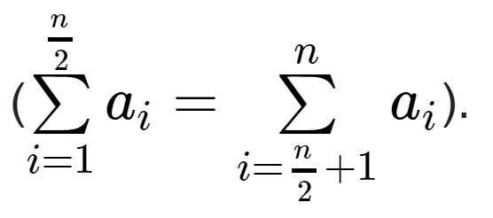

# Balanced Array
**Problem code**: 1343B  
**Tags**: constructive algorithms, math  
**Time limit per test**: 1 second  
**Memory limit per test**: 256 megabytes  
**Input**: standard input  
**Output**: standard output  

You are given a positive integer `n`, it is guaranteed that `n` is even (i.e. divisible by `2`).

* The first $\frac{n}{2}$	 elements of `a` are even (divisible by `2`);
* the second $\frac{n}{2}$	 elements of `a` are odd (not divisible by `2`);
* `all elements of a are distinct and positive`;
* the sum of the first half equals to the sum of the second half 

If there are multiple answers, you can print any. It is `not guaranteed` that the answer exists.

You have to answer `t` independent test cases.

## Input
The first line of the input contains one integer **t (1 ≤ t ≤ 10<sup>4</sup>)** — the number of test cases. Then `t` test cases follow.

The only line of the test case contains one integer **n (2 ≤ n ≤ 2*10<sup>5</sup>)** — the length of the array. It is guaranteed that that `n` is even (i.e. divisible by `2`).

It is guaranteed that the sum of `n` over all test cases does not exceed **2\*10<sup>5</sup> ($\sum$ n ≤ 2*10<sup>5</sup>)**.

## Output
For each test case, print the answer — "`NO`" (without quotes), if there is no suitable answer for the given test case or "`YES`" in the first line and **any** suitable array **a1, a2, …, an (1 ≤ ai ≤ 10<sup>9</sup>)** satisfying conditions from the problem statement on the second line.

## Examples
| input |
| :--- |
| 5 |
| 2 |
| 4 |
| 6 |
| 8 |
| 10 |

| output |
| :--- |
| NO |
| YES |
| 2 4 1 5 |
| NO |
| YES |
| 2 4 6 8 1 3 5 11 |
| NO |

## Solution
The solution in **C++**:
```cpp
#include <iostream>
#include <vector>
/* Author: José Rodolfo (jric2002) */
using namespace std;
int main() {
  unsigned int t, n, j;
  vector<unsigned int> a;
  cin >> t;
  for (unsigned int i = 0; i < t; i++) {
    cin >> n;
    if ((n % 4) == 0) {
      j = 1;
      while (j <= (n - 2)) {
        a.push_back(j);
        j += 1;
      }
      a.push_back(j + 1);
      a.push_back(j + (n / 2));
      cout << "YES" << endl;
      for (unsigned int k = 1; k < (n - 2); k += 2) {
        cout << a.at(k) << " ";
      }
      cout << a.at(n - 2) << " ";
      for (unsigned int k = 0; k < (n - 3); k += 2) {
        cout << a.at(k) << " ";
      }
      cout << a.at(n - 1) << endl;
      a.clear();
    }
    else {
      cout << "NO" << endl;
    }
  }
  return 0;
}
```

The solution in **Python 3**:
```python
# Author: José Rodolfo (jric2002)
t = int(input())
for i in range(0, t):
  n = int(input())
  a = []
  if ((n % 4) == 0):
    j = 1
    while (j <= (n - 2)):
      a.append(j)
      j += 1
    a.append(j + 1)
    a.append(j + int(n / 2))
    print("YES")
    for k in range(1, (n - 2), 2):
      print(a[k], end=" ")
    print(a[n - 2], end=" ")
    for k in range(0, (n - 3), 2):
      print(a[k], end=" ")
    print(a[n - 1])
  else:
    print("NO")
```