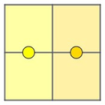

# Park Lighting
**Problem code**: 1358A  
**Tags**: greedy, math  
**Time limit per test**: 2 seconds  
**Memory limit per test**: 256 megabytes  
**Input**: standard input  
**Output**: standard output  

Due to the coronavirus pandemic, city authorities obligated citizens to keep a social distance. The mayor of the city Semyon wants to light up Gluharniki park so that people could see each other even at night to keep the social distance.

The park is a rectangular table with `n` rows and `m` columns, where the cells of the table are squares, and the boundaries between the cells are streets. External borders are also streets. Every street has length `1`. For example, park with `n = m = 2` has `12` streets.

You were assigned to develop a plan for lighting the park. You can put lanterns in the middle of the streets. The lamp lights two squares near it (or only one square if it stands on the border of the park).


The park sizes are: `n = 4`, `m = 5`. The lighted squares are marked yellow. Please note that all streets have length `1`. Lanterns are placed in the middle of the streets. In the picture `not all` the squares are lit.

Semyon wants to spend the least possible amount of money on lighting but also wants people throughout the park to keep a social distance. So he asks you to find the minimum number of lanterns that are required to light all the squares.

## Input
The first line contains a single integer **t (1 ≤ t ≤ 10<sup>4</sup>)** — the number of test cases in the input. Then `t` test cases follow.

Each test case is a line containing two integers `n, m` **(1 ≤ n, m ≤ 10<sup>4</sup>)** — park sizes.

## Output
Print `t` answers to the test cases. Each answer must be a single integer — the minimum number of lanterns that are required to light all the squares.

## Examples
| input |
| :--- |
| 5 |
| 1 1 |
| 1 3 |
| 2 2 |
| 3 3 |
| 5 3 |

| output |
| :--- |
| 1 |
| 2 |
| 2 |
| 5 |
| 8 |

## Note
Possible optimal arrangement of the lanterns for the `2-nd` test case of input data example:


Possible optimal arrangement of the lanterns for the `3-rd` test case of input data example:



## Solution
The solution in **C++**:
```cpp
#include <iostream>
/* Author: José Rodolfo (jric2002) */
using namespace std;
int main() {
  unsigned short int t, n, m;
  unsigned int l;
  cin >> t;
  while (t--) {
    cin >> n >> m;
    l = n * m;
    if ((l % 2) != 0) {
      l = (l + 1) / 2;
    }
    else {
      l = l / 2;
    }
    cout << l << endl;
  }
  return 0;
}
```

The solution in **Python 3**:
```python
# Author: José Rodolfo (jric2002)
t = int(input())
while (t):
  n, m = map(int, input().split(" "))
  l = n * m
  if ((l % 2) != 0):
    l = int((l + 1) / 2)
  else:
    l = int(l / 2)
  print(l)
  t -= 1
```