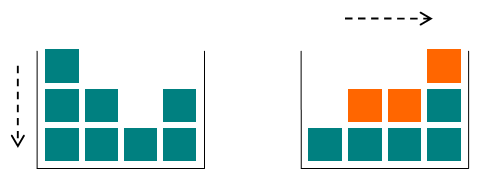

# Gravity Flip
**Problem code**: 405A  
**Tags**: greedy, implementation, sortings  
**Time limit per test**: 1 second  
**Memory limit per test**: 256 megabytes  
**Input**: standard input  
**Output**: standard output  

Little Chris is bored during his physics lessons (too easy), so he has built a toy box to keep himself occupied. The box is special, since it has the ability to change gravity.

There are `n` columns of toy cubes in the box arranged in a line. The `i-th` column contains `ai` cubes. At first, the gravity in the box is pulling the cubes downwards. When Chris switches the gravity, it begins to pull all the cubes to the right side of the box. The figure shows the initial and final configurations of the cubes in the box: the cubes that have changed their position are highlighted with orange.



Given the initial configuration of the toy cubes in the box, find the amounts of cubes in each of the `n` columns after the gravity switch!

## Input
The first line of input contains an integer `n (1 ≤ n ≤ 100)`, the number of the columns in the box. The next line contains `n` space-separated integer numbers. The `i-th` number `ai (1 ≤ ai ≤ 100)` denotes the number of cubes in the `i-th` column.

## Output
Output `n` integer numbers separated by spaces, where the `i-th` number is the amount of cubes in the `i-th` column after the gravity switch.

## Examples
| input |
| :--- |
| 4 |
| 3 2 1 2 |

| output |
| :--- |
| 1 2 2 3 |

| input |
| :--- |
| 3 |
| 2 3 8 |

| output |
| :--- |
| 2 3 8 |

## Note
The first example case is shown on the figure. The top cube of the first column falls to the top of the last column; the top cube of the second column falls to the top of the third column; the middle cube of the first column falls to the top of the second column.

In the second example case the gravity switch does not change the heights of the columns.

## Solution
The solution in **C**:
```c
#include <stdio.h>
/* Author: José Rodolfo (jric2002) */
void bubbleSort(unsigned short int [], unsigned short int);
int main() {
  unsigned short int n;
  unsigned short int c[100];
  scanf("%hu", &n);
  for (unsigned short int i = 0; i < n; i++) {
    scanf("%hu", &c[i]);
  }
  bubbleSort(c, n);
  for (unsigned short int i = 0; i < n; i++) {
    printf("%i ", c[i]);
  }
  return 0;
}
void bubbleSort(unsigned short int a[], unsigned short int size_a) {
  int tn;
  for (int i = 1; i < size_a; i++) {
    for (int j = 0; j < (size_a - i); j++) {
      if (a[j] > a[j + 1]) {
        tn = a[j + 1];
        a[j + 1] = a[j];
        a[j] = tn;
      }
    }
  }
}
```

The solution in **C++**:
```cpp
#include <iostream>
#include <vector>
#include <algorithm>
/* Author: José Rodolfo (jric2002) */
using namespace std;
int main() {
  unsigned short int n, ai;
  vector<unsigned short int> c;
  cin >> n;
  while (n--) {
    cin >> ai;
    c.push_back(ai);
  }
  sort(c.begin(), c.end());
  for (unsigned short int a : c) {
    cout << a << " ";
  }
  return 0;
}
```

The solution in **Python 3**:
```python
# Author: José Rodolfo (jric2002)
n = int(input())
c = [int(x) for x in input().split(" ")]
c.sort()
for a in c:
  print(a, end=' ')
```

The solution in **Java**:
```java
/* Author: José Rodolfo (jric2002) */
import java.util.Scanner;
import java.io.BufferedReader;
import java.io.InputStreamReader;
import java.io.IOException;
import java.util.Arrays;
public class GravityFlip {
  public static void main(String[] args) throws IOException {
    int n;
    Integer[] c;
    int i;
    Scanner input_n = new Scanner(System.in);
    n = input_n.nextInt();
    c = new Integer[n];
    BufferedReader input_a = new BufferedReader(new InputStreamReader(System.in));
    i = 0;
    for (String ai : (input_a.readLine()).split(" ")) {
      c[i] = Integer.valueOf(ai);
      i++;
    }
    Arrays.sort(c);
    for (int ai : c) {
      System.out.print(ai + " ");
    }
  }
};
```